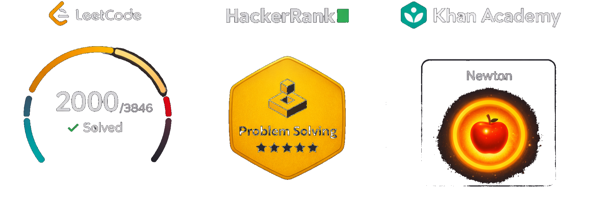

 
 
 
 
 

# Hi, I'm Venkat 👋
 

📍 **Hyderabad, India** | ☁️ **Azure / AWS & AI Architect** | 🤖 **Agentic AI Systems** | **8+ Years**

> Designing production-grade Azure/AWS architectures and multi-agent AI systems - event-driven pipelines, serverless orchestration, RAG platforms, and agentic runtimes. 7 AWS CDK stacks shipped. 🏆 2000+ LeetCode problems solved.

## Projects

- ⚡ **[blinkr](https://github.com/venkateshwarreddyr/blinkr)** - High-throughput URL shortener at 10K writes/sec - consistent hashing, multi-layer caching
- 🤖 **[agent-forge](https://github.com/venkateshwarreddyr/agent-forge)** - Production multi-agent platform - supervisor routing, cost tracking
- 🌐 **[browser-copilot](https://github.com/venkateshwarreddyr/browser-copilot)** - Agentic browser automation - plan-approve-execute loop
- 🏗️ **[project-orchestrator](https://github.com/venkateshwarreddyr/project-orchestrator)** - Multi-agent code generation - coder + reviewer agents, auto-review loop, LangGraph orchestration
- 🧩 **[x-skills-for-ai](https://github.com/venkateshwarreddyr/x-skills-for-ai)** - Reusable AI agent skill runtime - framework-agnostic, intention-based routing · [npm core](https://www.npmjs.com/package/@x-skills-for-ai/core) · [npm react](https://www.npmjs.com/package/@x-skills-for-ai/react)
- 📋 **[resume-job-matcher](https://github.com/venkateshwarreddyr/resume-job-matcher)** - RAG-powered resume analysis - match score, skill gaps, interview tips & salary estimate
- 💻 **[code-interview-evaluator](https://github.com/venkateshwarreddyr/code-interview-evaluator)** - AI code review pipeline - complexity, edge cases, quality & alternatives
- 📄 **[repo-summarizer-ai](https://github.com/venkateshwarreddyr/repo-summarizer-ai)** - GitHub repo intelligence - purpose, architecture & tech stack via LLM pipeline
- 🎨 **[ai-avatar-generator](https://github.com/venkateshwarreddyr/ai-avatar-generator)** - Multi-model image generation - 8 art styles, serverless inference, 4 variation outputs
- 🎤 **[skill-craft](https://github.com/venkateshwarreddyr/skill-craft)** - Full-duplex voice AI - xAI Grok Realtime, dynamic skill tool calling, WebSocket streaming
- 🔤 **[ai-lang](https://github.com/venkateshwarreddyr/ai-lang)** - AI prompt DSL compiler - PEG.js → AST → AI-compatible JSON structured output
- 🎭 **[stage-craft](https://github.com/venkateshwarreddyr/stage-craft)** - AI-driven E2E testing - Playwright + Cucumber BDD + ZeroStep AI
- 🖼️ **[nebula-canvas](https://github.com/venkateshwarreddyr/nebula-canvas)** - Real-time collaborative canvas - CRDT sync (Yjs), AI shape recognition, offline-first
- 🐹 **[go-posts-api](https://github.com/venkateshwarreddyr/go-posts-api)** - REST API - Go, Gin, PostgreSQL, clean service/repo layers
- 💨 **[posts-browser](https://github.com/venkateshwarreddyr/posts-browser)** - React SPA - Router v6, Tailwind CSS
- 👾 **[space-invaders](https://github.com/venkateshwarreddyr/space-invaders)** - Terminal game - threaded renderer, WAV audio, Rust + crossterm
- 🏎️ **[race-car](https://github.com/venkateshwarreddyr/race-car)** - 2D racing game - sprite collision, health system, Rust + rusty_engine
- 🏆 **[my-leetcode-solutions](https://github.com/venkateshwarreddyr/my-leetcode-solutions)** - 2000+ solutions with filters & analytics - JS, Rust, SQL, C++, Go, Python, Java

## Achievements

|                                                                     |                                                                 |                                           |
| ------------------------------------------------------------------- | --------------------------------------------------------------- | ----------------------------------------- |
| ☁️ **7 AWS CDK Stacks** - Lambda · DynamoDB · ECS · S3 · CloudFront | 🤖 **Multi-Agent AI** - Supervisor routing, RAG, MCP, LangGraph | 🕸️ **Multi-Cloud** - AWS + Azure + GCP    |
| 🏆 **2000+** LeetCode Problems · Peak Rating **1800+**              | 🧩 **480+** Dynamic Programming Problems                        | 📦 **npm** Published - `@x-skills-for-ai` |

## Technical Skills

- Cloud Architecture
  - Azure (Functions, Durable Functions, Service Bus, PubSub, Blob Storage) · AWS (Lambda, ECS Fargate, EC2, S3, DynamoDB, RDS, SQS, SNS, API Gateway, CloudFront, ElastiCache, CDK, IAM, VPC) · GCP · Event-Driven & Serverless Architecture
- AI / ML Architecture
  - Multi-Agent Orchestration (LangGraph, Supervisor Pattern) · RAG Pipelines · MCP · OpenAI GPT-4o · Gemini Live · Vertex AI · HITL Workflows · Multi-Cloud AI Strategy
- LLM & Agentic AI
  - LangChain · LangGraph · Tool/Function Calling · Structured Outputs · SSE Streaming · Prompt Engineering · PGVector · Vector Search
- Backend & Systems
  - Node.js · Python · Express · NestJS · Flask · FastAPI · Microservices · RESTful APIs · Docker · CI/CD · Redis Pub/Sub · Queue-Based Pipelines
- Databases
  - DynamoDB · PostgreSQL · MySQL · MongoDB · Redis · SQLite · Prisma ORM · PGVector
- Frontend
  - React.js · TypeScript · Redux / Redux-Saga · Angular 4/7 · Tailwind CSS · Material UI
- Languages
  - TypeScript · Python · JavaScript · Go · Rust · Java · C · C++
- DSA & System Design
  - Dynamic Programming (480+) · Graphs & Trees (100%) · Binary Search · BFS/DFS · Union-Find · Segment Trees · System Design

## Experience

**RealPage India** · Software Engineer III · _Apr 2024 – Present_

- **AI Architecture**: Designed multi-cloud AI platform (AWS + Azure) for contract intelligence - risk signal extraction from legal contracts and SOC reports
- **Serverless Orchestration**: Built supervisor-pattern multi-agent routing layer on Azure Functions with Redis Pub/Sub for real-time HITL browser automation (SSE)
- **RAG Pipeline**: Engineered legal document generation system mapping dynamic placeholders to structured knowledge bases via vector search
- **AI Voice Platform**: Integrated Google Gemini Live + MCP with HTML-to-Markdown screen analysis for proactive, low-latency UI guidance
- **Multi-Agent Factory**: Architected autonomous script generation system - analyzes websites and produces web automation scripts end-to-end
- **CRM Automation**: Delivered Salesforce AI toolkit using Model Context Protocol (MCP) for case, contact, and opportunity workflows

**SyrenCloud** · Lead Software Engineer · _Dec 2023 – Mar 2024_

- Supply Chain KPI dashboard - demoed to Coca-Cola

**BNMA.INC** · Senior Software Engineer · _Oct 2022 – Sep 2023_

- **AWS Infrastructure**: Architected secure prenatal healthcare SaaS (Juno Diagnostics) on AWS - Cognito for auth, S3 for data storage, React + TypeScript frontend

**iSpace Software Solutions** · Software Engineer · _Mar 2021 – Sep 2022_

- KornFerry Advance enterprise SaaS - large dataset rendering optimization, custom logging, super admin delegation

**CREATECOMM TECH** · Software Engineer · _Jun 2019 – Feb 2021_

- Intercity food delivery platform - microservices backend, RESTful APIs, built with CXO team from inception to deployment

**Pixel-Brook Software Solutions** · Software Engineer · _May 2018 – Jun 2019_

- 24SkinClinic SaaS (Angular + Python/Flask), hybrid DB architecture for time-series data, IMF data ETL pipelines on GCP

## Education

🎓 **B.Tech, Computer Science** - Vignan University, 2014–2018
🎓 **AI, AWS, Advanced DSA** - TwoAnswers Leadership Career Coaching Platform, 2022–Present

## Domain Expertise

Real Estate Tech · Healthcare / Pharma · E-commerce · Enterprise SaaS

## What I'm Working On

- ☁️ **AWS architectures** - ECS Fargate, SQS, DynamoDB, Lambda, CDK infrastructure-as-code
- 🤖 **Agentic AI platforms** - multi-agent orchestration, LangGraph supervisor patterns, RAG pipelines
- 🔗 **Event-driven systems** - queue-based pipelines, Redis Pub/Sub, SSE, real-time AI backends
- 🧠 **LLM integrations** - MCP, structured outputs, tool calling, multi-cloud AI strategies

## Profile Links

- [GitHub](https://github.com/venkateshwarreddyr)
- [Khan Academy](https://www.khanacademy.org/profile/venkateshwarreddyr/)
- [HackerRank](https://www.hackerrank.com/profile/venkateshwarredd)

## Connect

