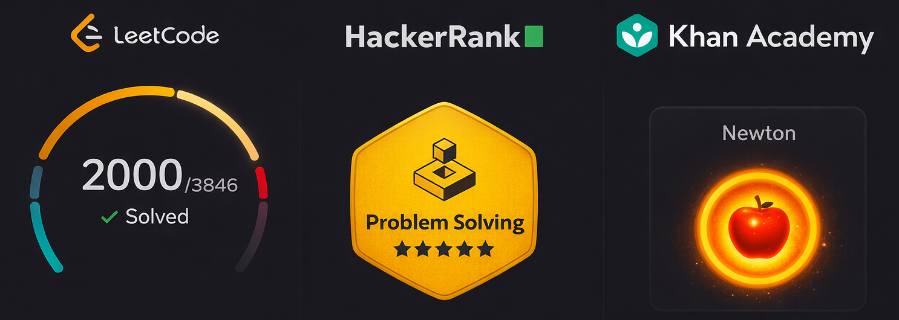

 
 
 

# Venkat — Cloud & Agentic AI Architect

📍 Hyderabad, India · **8+ years** building production Azure/AWS platforms and multi-agent AI systems for legal, healthcare, and SaaS teams.

**Currently:** Software Engineer III @ RealPage — architecting a multi-cloud AI platform for contract intelligence (AWS + Azure, LangGraph, RAG, MCP).

> 7 AWS CDK stacks shipped · 2000+ LeetCode solved · npm publisher · multi-agent systems in production

## Flagship Work

- ⚡ **[blinkr](https://github.com/venkateshwarreddyr/blinkr)** — High-throughput URL shortener at **10K writes/sec** with consistent hashing and multi-layer caching.
- 🤖 **[agent-forge](https://github.com/venkateshwarreddyr/agent-forge)** — Production multi-agent platform with supervisor routing, cost tracking, and policy guardrails.
- 🌐 **[browser-copilot](https://github.com/venkateshwarreddyr/browser-copilot)** — Agentic browser automation using a plan → approve → execute loop with HITL checkpoints.
- 🏗️ **[project-orchestrator](https://github.com/venkateshwarreddyr/project-orchestrator)** — Multi-agent code generation: coder + reviewer agents in an auto-review loop on LangGraph.
- 🧩 **[x-skills-for-ai](https://github.com/venkateshwarreddyr/x-skills-for-ai)** — Framework-agnostic AI agent skill runtime with intention-based routing. Published on npm ([@x-skills-for-ai/core](https://www.npmjs.com/package/@x-skills-for-ai/core) · [@x-skills-for-ai/react](https://www.npmjs.com/package/@x-skills-for-ai/react)).
- 🎤 **[skill-craft](https://github.com/venkateshwarreddyr/skill-craft)** — Full-duplex voice AI on xAI Grok Realtime with dynamic tool calling and WebSocket streaming.

## Stack

**Cloud** — Azure (Functions, Durable Functions, Service Bus, PubSub) · AWS (Lambda, ECS Fargate, S3, DynamoDB, SQS, SNS, API Gateway, CloudFront, ElastiCache, CDK) · GCP
**AI / Agents** — LangChain · LangGraph (supervisor pattern) · RAG · MCP · OpenAI · Gemini Live · Vertex AI · PGVector
**Backend** — Node.js · Python · TypeScript · Go · Rust · FastAPI · Express · NestJS · Redis · Docker · CI/CD
**Frontend** — React · Redux · Angular · Tailwind · Material UI
**Data** — DynamoDB · PostgreSQL · MySQL · MongoDB · Redis · Prisma · PGVector

## Experience

**RealPage India** — Software Engineer III · _Apr 2024 – Present_

- Designed a **multi-cloud AI platform** (AWS + Azure) for contract intelligence — risk signal extraction from legal contracts and SOC reports.
- Built a **supervisor-pattern multi-agent router** on Azure Functions with Redis Pub/Sub for real-time HITL browser automation over SSE.
- Engineered a **RAG pipeline** for legal document generation mapping dynamic placeholders to structured knowledge bases via vector search.
- Integrated **Google Gemini Live + MCP** with HTML-to-Markdown screen analysis for proactive, low-latency UI guidance.
- Architected an autonomous **multi-agent script-generation factory** that analyzes websites and ships web automation scripts end-to-end.
- Delivered a **Salesforce AI toolkit** over Model Context Protocol (MCP) for case, contact, and opportunity workflows.

**BNMA.INC** — Senior Software Engineer · _Oct 2022 – Sep 2023_

- Architected a HIPAA-style **prenatal healthcare SaaS** (Juno Diagnostics) on AWS — Cognito, S3, React + TypeScript.

**iSpace Software Solutions** — Software Engineer · _Mar 2021 – Sep 2022_

- **Korn Ferry Advance** enterprise SaaS — large-dataset rendering optimization, custom logging pipeline, super-admin delegation.

**CREATECOMM TECH** — Software Engineer · _Jun 2019 – Feb 2021_

- Intercity food-delivery platform — microservices backend, REST APIs, built with the CXO team from inception to launch.

**Pixel-Brook Software Solutions** — Software Engineer · _May 2018 – Jun 2019_

- **24SkinClinic** SaaS (Angular + Python/Flask), hybrid DB architecture for time-series data, IMF ETL pipelines on GCP.

## Education

- 🎓 B.Tech, Computer Science — Vignan Institute of Technology and Science, 2014–2018
- 🎓 AI, AWS, Advanced DSA — TwoAnswers Leadership Career Coaching, 2022–Present

## Domains

Real Estate Tech · Healthcare & Pharma · E-commerce · Enterprise SaaS

## Connect

